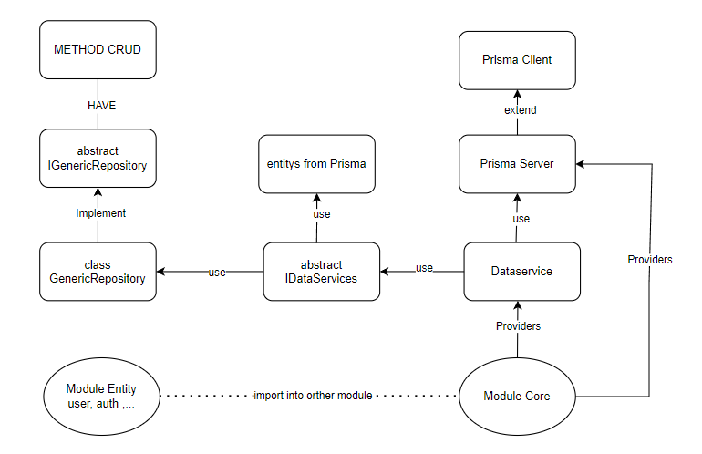

# Hướng dẫn xây dựng kiến trúc sạch cho dự án NestJS với Prisma

### Đầu tiên bài viết được tham khảo từ nguồn đọc này [here](https://betterprogramming.pub/clean-node-js-architecture-with-nestjs-and-typescript-34b9398d790f). Mục đích để xây dựng lại 1 cấu trúc nestjs viết với prisma. Nhằm xây dựng và quản lý project 1 cách hiệu quả trong quá trình xây dựng.
## TREE 
<pre>

D:.
├───dist
│   ├───common
│   ├───core
│   │   ├───abstracts
│   │   ├───prisma
│   │   ├───repositories
│   │   └───services
│   └───modules
│       └───user-account-status
│           ├───controllers
│           ├───dtos
│           └───services
├───prisma
│   └───migrations
│       └───20240520144202_init
├───src
│   ├───common
│   ├───core
│   │   ├───abstracts
│   │   ├───prisma
│   │   ├───repositories
│   │   └───services
│   └───modules
│       └───user-account-status
│           ├───controllers
│           ├───dtos
│           ├───services
│           └───tests
└───test
</pre>

## Database demo

<pre>
generator client {
  provider = "prisma-client-js"
}

datasource db {
  provider = "mysql"
  url      = env("DATABASE_URL")
}

model user_account_status {
  id           Int           @id @default(autoincrement())
  code         String        @db.VarChar(50)
  name         String        @db.VarChar(100)
  user_account user_account?
}

model user_account {
  id                    Int                 @id @default(autoincrement())
  username              String              @db.VarChar(50)
  email                 String              @db.VarChar(50)
  password              String              @db.VarChar(30)
  accessToken           String              @db.VarChar(700)
  refresheToken         String              @db.VarChar(700)
  user_account_status_id Int                @unique(map: "idUser_account_status")
  user_account_status   user_account_status @relation(fields: [user_account_status_id], references: [id])
  user_profile_id       Int @unique
  user_profile          user_profile        @relation(fields: [user_profile_id], references: [id])
}

model user_profile {
  id            Int              @id @default(autoincrement())
  firstname     String           @db.VarChar(50)
  lastname      String           @db.VarChar(50)
  fullname      String           @db.VarChar(100)
  email         String           @db.VarChar(50)
  time_zone     String           @db.VarChar(100)
  google_account google_account?
  user_account   user_account?
}

model google_account {
  user_profile_id    Int          @id
  google_account_id  String       @db.VarChar(100)
  user_profile       user_profile @relation(fields: [user_profile_id], references: [id])
}

</pre>

## Sơ đồ 

- Đây là một ví dụ về cách triển khai nguyên tắc thiết kế kiến trúc sạch (clean architecture) trong dự án NestJS kết hợp với Prisma:
  

### 1. IGenericRepository và GenericRepository:
   
    - IGenericRepository là một abstract class đại diện cho một repository chung có các phương thức cơ bản như getAll, get, create, update, và delete.
    - GenericRepository là một implementation của IGenericRepository, cung cấp các phương thức cơ bản cho việc tương tác với cơ sở dữ liệu bằng cách sử dụng Prisma.
  
### 2. IDataServices:
    - IDataServices là một abstract class đại diện cho các dịch vụ dữ liệu (data services) trong ứng dụng, bao gồm các repository chung như user_account_status, user_account, user_profile, và google_account.
    - Các dịch vụ này được khai báo với kiểu dữ liệu là GenericRepository, cho phép chúng ta sử dụng các phương thức cơ bản từ IGenericRepository.
  
### 3. DataService:
    - DataService là một implementation của IDataServices, cung cấp các dịch vụ dữ liệu cụ thể cho ứng dụng.
    - Trong constructor của DataService, chúng ta khởi tạo các repository cụ thể bằng cách sử dụng GenericRepository, và cung cấp cho chúng thông qua PrismaService.

### Nguyên tắc chính:
    - Phân tách lớp trừu tượng và lớp cụ thể: IGenericRepository là lớp trừu tượng đại diện cho một repository chung, trong khi GenericRepository là lớp cụ thể thực hiện các phương thức cụ thể cho repository đó.
    - Độc lập với cơ sở dữ liệu và bên ngoài: GenericRepository được thiết kế để hoạt động độc lập với cơ sở dữ liệu cụ thể, cho phép thay đổi cơ sở dữ liệu một cách dễ dàng nếu cần thiết.
    - Sử dụng dependency injection: DataService sử dụng dependency injection để chuyển các repository vào bên trong nó, giúp tạo ra các dịch vụ dữ liệu một cách linh hoạt và dễ mở rộng.

## Cảm ơn đã xem! Rất mong được nhận được start và phản hồi từ bạn!